# Claude Code

## 安装Claude Code

1. **安装 Git Bash**

   Claude Code 原生是为 Linux / macOS 设计的，而 Windows 系统命令不同，所以需要装 Git 来进行一个准备工作。

2. **安装 Claude Code**

   打开终端（Windows 用 PowerShell，Mac/Linux 用 Terminal），粘贴命令即可：

   ```bash
   # Windows - PowerShell
   irm https://daheiai.com/cc.ps1 | iex
   
   # Windows - CMD
   curl -fsSL https://claude.ai/install.cmd -o install.cmd && install.cmd && del install.cmd
   
    # macOS / Linux
   curl -fsSL https://claude.ai/install.sh | bash
   ```

   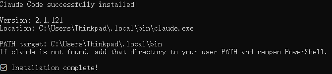

3. **配置环境变量 PATH**

   把 `C:\Users\你的用户名\.local\bin\` 加到用户级 PATH。

4. **安装 cc-switch，接入更多模型**

   **CC Switch的GitHub仓库下载页**：[https://github.com/farion1231/cc-switch/releases](https://github.com/farion1231/cc-switch/releases)

   软件装好了，但还没有 AI 模型可用。这时候需要 **cc-switch**，它可以切换不同的 AI 模型提供商。

   Claude、GPT 等模型可通过 [API 服务](https://api.daheiai.com/) 接入。我买的是 DouBaoSeed [https://www.volcengine.com/product/doubao](https://www.volcengine.com/product/doubao) 和 Qwen Coder [https://bailian.console.aliyun.com](https://bailian.console.aliyun.com) 的 Token Plan

5. **开始使用**

   - 先进入你要工作的文件夹，再输入 `claude`。右键文件夹用终端打开最快；如果右键没有，就先打开终端，再用 `cd + 文件夹路径` 进入工作目录

   - Windows Git Bash 默认情况下得输入 `claude.exe` 才能启动，如果想输入 `claude` 启动，需要输入如下命令：
   
     ```bash
     # 修改指向
     echo 'alias claude="$HOME/.local/bin/claude.exe"' >> ~/.bashrc
     # 让配置立即生效
     source ~/.bashrc
     ```
   
     
   
   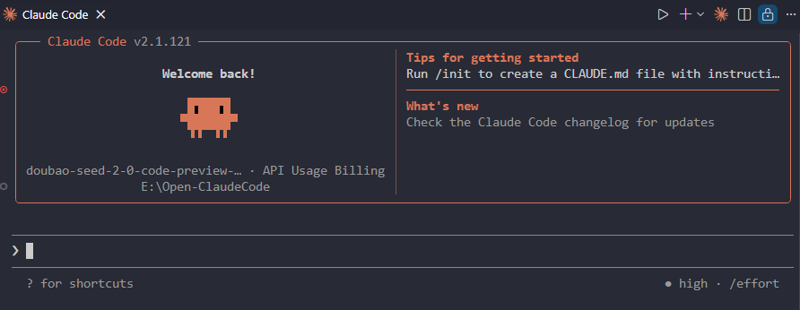

> [Doubao-Seed-2.0-Code](https://console.volcengine.com/ark/region:ark+cn-beijing/openManagement?LLM=%7B%7D&advancedActiveKey=agentPlan)

## 基础实操

> Claude Code 后面都会简写为 CC

### cc 模式

默认情况下，CC 接到任务后会进入计划模式（Plan Mode），CC 有如下三种模式

| 模式             | 功能                                                         |
| :--------------- | :----------------------------------------------------------- |
| 默认模式         | 启动 Claude Code 后的初始交互状态，类似于一个增强版的对话终端，用于意图确认、信息查询和简单任务。 |
| 计划模式         | Claude 进行复杂的代码更改时，它会进入这一阶段。分析需求并制定执行步骤。不直接动代码。 |
| Accept Edits模式 | 这是 Claude Code 的“落地”阶段，会执行代码变更的最终确认与写入 |

如果希望CC能一路绿灯执行所有操作，需要输入指令`/exit` 退出重启后，在启动CC时输入以下命令

```bash
claude --dangerously-skip-permissions
```

每次输入这么长还是有些麻烦，可以设置 cc 别名，使用 c-d 命令来启动 claude 绕过权限

```bash
# 修改指向
echo 'alias c-d="claude --dangerously-skip-permissions"' >> ~/.bashrc
# 让配置立即生效
source ~/.bashrc
```

当然还可以通过编辑 `~/.claude/settings.json` 文件达到绕过权限的效果

### cc 交互方式

基础交互

- 直接文字对话

进阶交互

- 使用 `@` 指令让CC进行本地文件信息查找

- 直接拖拽图片至对话框，或复制/粘贴

- 注意：在CC文本框内换行的快捷键（**不是** Shift + Enter）：

  - **Windows：**`Ctrl + Enter`

  - **macOS：**`Option + Enter`

| Claude指令  | 功能说明                                                     |
| :---------- | :----------------------------------------------------------- |
| `/help`     | 提供所有指令，以及指令背后遵循的意思                         |
| `/model`    | 切换高中低档模型                                             |
| `/btw`      | By the way缩写，可以暂时切出正在执行的项目，隔离上下文，方便使用者与CC进行临时对话。会话完毕后，可按esc消除临时会话 |
| `/simplify` | 输入后会派生出3个agent，从代码质量、运行效率和复用性三个角度做一次代码审核，然后自动优化修改 |
| `/rewind`   | 进入回滚界面                                                 |
| `/compact`  | 主动压缩精简上下文                                           |
| `/clear`    | 彻底清空上下文，相当于重开一个会话                           |
| `/context`  | 详细展示agent当前的上下文信息，诸如：上下文占比，上下文类别等等 |
| `/resume`   | 在全新的上下文窗口，选择恢复到之前的对话                     |
| `/init`     | 初始化创建项目级Claude.md                                    |
| `/memory`   | 针对Claude的全局、项目记忆，以及auto memory进行操作和管理    |
| `/agents`   | 创建、调用、管理子agent                                      |
| `/plugin`   | 发现新插件，管理已下载插件，新增插件生态                     |

## 掌控与管理

### cc 回滚

按两下 Esc 可以回滚

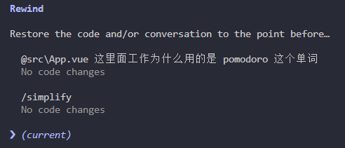

但是呢这个快捷回滚有局限：它只能撤销 CC 自己编辑的文件，如果 CC 执行了一些终端命令，比如说安装了一些包、下载了一些东西在我们的项目里面，这些都是无法撤回的。所以真正靠谱的后悔药是 Git

### 上下文管理

用 CC 时间长了，你可能会发现，CC 的回答变慢，质量也下降了，这就是萦绕在所有 AI 头上最困扰的问题，上下文窗口有限。而且像我们平时看见那些大模型动辄就是100万200万的上下文窗口，但实际上它有效的比例，只有60%~80%，而且它还会随着上下文的增多，大模型的能力随之下降。应对这种情况有两个命令：

1. `/compact` 主动压缩上下文

   不仅省更多的 token，也让大模型更专注当期的新任务

2. `/clear` 彻底清空，相当于新开一个对话框

输入`/context`命令，它会详细的展示我们的上下文占比信息

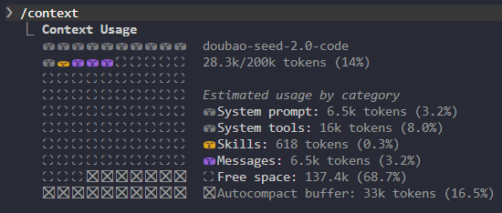

但是每一次手动输入这个，也是比较麻烦的，如果想随时能看见上下文占比，可以输入如下提示词，让 CC 帮忙打开这个功能

- 帮我配一个 statusLine,显示当前目录+模型+上下文剩余百分比

之后重启 CC 才可以开启功能，但是这时你会发现，现在我们进入的是一个新的对话，没有任何上下文，如果我们想回到之前的对话

1. 需要输入 `/resume`，选择恢复哪一次对话
2. 启动时输入 `claude -c`

### 状态栏

显示当前模型、上下文百分比等等

```bash
/statusline
```

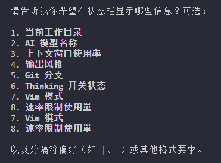

| 序号 | 选项              | 对你的作用                                                   |
| ---- | ----------------- | ------------------------------------------------------------ |
| 1    | 当前工作目录      | 显示你在哪个项目目录下，方便区分多项目会话                   |
| 2    | AI 模型名称       | 显示当前用的是 Opus/Sonnet 哪个模型，避免忘记                |
| 3    | 上下文窗口使用率  | 核心！实时显示 Token 占用百分比，帮你判断什么时候该 `/compact` 或 `/clear` |
| 4    | 输出风格          | 显示当前的输出格式（如 markdown/terminal 等），一般用不到    |
| 5    | Git 分支          | 显示当前所在的 Git 分支，多分支开发时很实用                  |
| 6    | Thinking 开关状态 | 显示是否开启了深度思考模式，可按需查看                       |
| 7    | Vim 模式          | 显示是否开启了 Vim 键绑定，如果你不用 Vim 模式可以忽略       |
| 8    | 速率限制使用量    | 显示 Claude 的 API 调用配额剩余，避免超限被限制              |

我设置的1、2、3、5

## 个性化

CC 一共有三个个性化记忆机制，两个内置，一个自行构建，这三个共同目标都是为了让 CC 记住你是谁？项目在做什么？你有什么要求？

第一个就是 Claude.md

### Claude.md

它会让我们跟 CC 说任何东西之前第一时间被读入上下文，Claude.md 分三层

第一层是全局级，所有项目通用的原则：

- 永远使用中文回答
- 我是...

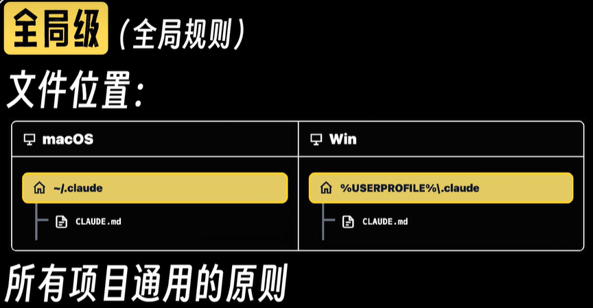

第二层是项目级，单独项目规则：

- 技术架构
- 开发规范
- 设计风格

第三层是子文件级

- 一般情况用不太上

Claude.md 这个文件不用一上来在空项目的时候，就自己手动去建这个 CLAUDE.md，而是等项目有了一定雏形了，再用 `/init` 初始化

全局级md规则：

- 不要塞太多内容
- 最顶层、长期稳定的原则
- 逐步添加高频错误修正

> [受 Karpathy 启发的 Claude Code 使用指南（中文版）](https://github.com/tev6/andrej-karpathy-skills-zhCN)
>
> 1. 先思考，后编码
>
>    **不要假设。不要隐藏困惑。呈现权衡方案。**
>
> 2. 简洁至上
>
>    **用最少的代码解决问题。不写任何推测性内容。**
>
> 3. 精准修改
>
>    **只触碰必须改动的部分。只清理你自己造成的烂摊子。**
>
> 4. 目标计划执行
>
>    **定义成功标准。循环直至验证通过。**

### Auto Memory

- 打开Auto Memory：输入`/memory` ，选择「**Auto-memory**」并输入回车开启

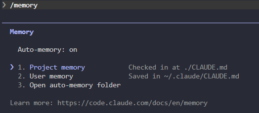

## 扩展

### Skill

可以简单的理解为，给AI的各式各样的子领域的专业说明书或操作手册

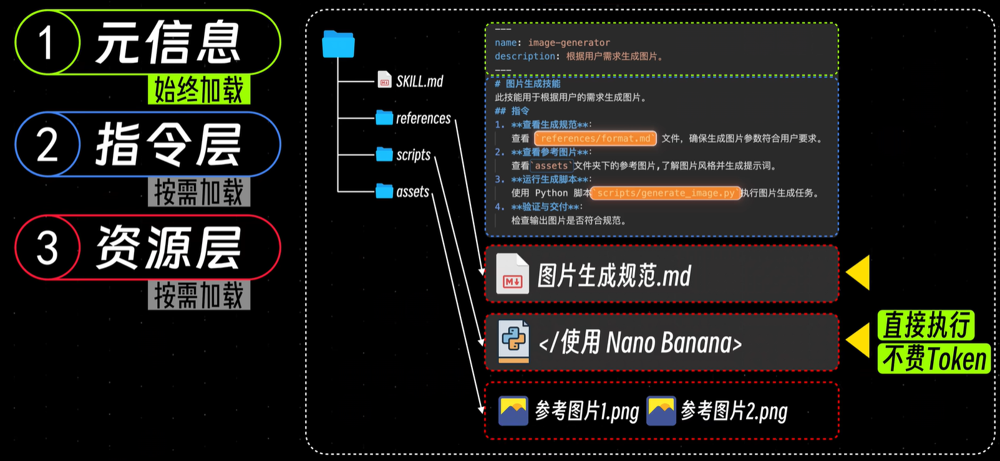

比如说炒菜技能：

1. 流程 -> SKILL.md
   - 炒菜顺序
2. 配方 -> references
   - 油温多高
   - 盐放多少
3. 工具 -> scripts
   - 煤气灶
   - 炒锅
4. 材料 -> assets
   - 辣椒酱

Skill 按需加载三层结构

1. 元信息（始终加载）
2. 指令层
3. 资源层

### MCP

MCP 实际上解决AI和外部工具、外部服务连接的那个转接头

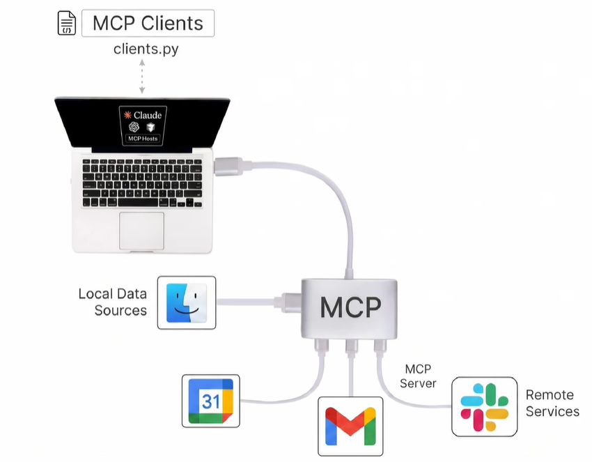

### CLI

CLI（Command Line Interface）命令行工具

- CLI：[Command-line interface](https://github.com/topics/cli)

| **CLI名称** | **功能**                                                     |
| :---------- | :----------------------------------------------------------- |
| 飞书CLI     | 飞书官方CLI工具，覆盖消息、文档、多维表格、电子表格、幻灯片、日历、邮箱、任务、会议等核心业务域，提供200+命令及24个AI Agent Skills |
| OpenCLI     | 万能命令行工具箱，通用命令行中心与AI原生运行平台，能将任何网站、桌面应用或本地程序变成统一命令行操作界面 |
| CLI         | GitHub 的官方命令行工具。它将拉取请求、问题和其他 GitHub 概念带到终端中，与你已经在使用 `git` 和代码的地方并排显示。 |
| gemini-CLI  | Gemini CLI 可将 Gemini 的功能直接引入终端。它提供轻量级的 Gemini 访问方式，能够以最直接的方式从终端命令访问 Gemini 模型。 |

### SubAgent

创建子Agent的两种方式：

1. **自动触发：**任务复杂且存在并行可能时，CC会自动派生子Agent并行推进
2. **手动创建：**通过指令 `/agents` ，在Library界面进行创建

**手动创建步骤：**

1. 选择创建项目级或全局级子Agent
2. 选择「AI辅助创建」，让AI根据意图辅助创建
3. 描述想要的子Agent功能
4. 决定子Agent工具权限（✓为选中）
5. 选择Claude的模型
6. 为子Agent挑选区别于主Agent的颜色
7. 调用与管理子Agent

### Hook

推荐以下Hook设置，直接告诉CC帮忙设置：

- 设置一个hook，每次完成任务之后，都自动执行一个声音脚本，发出一个提示音"叮"进行提醒
- 设置一个hook，每次提交代码之前，都会自动触发代码格式的检查

## Plugin

> [https://claude.com/plugins](https://claude.com/plugins)

插件是打包了 **Skill**、**SubAgent**、**Hook**、**MCP** 的整合性概念

1. 通过指令 `/plugin` 进入插件管理界面
2. 在插件管理界面，可以收录下载钟意的插件，或管理已下载插件

### superpowers

> [https://github.com/obra/superpowers](https://github.com/obra/superpowers)

让 Claude Code 像正经工程师一样按流程干活

- 强制先想清楚需求（Brainstorming）Claude
- 再做详细计划（Write Plan）Claude
- 强制 TDD：先写会失败的测试 → 再写代码让它过 → 再重构
- 自动 Code Review、子任务拆分、Git 分支隔离Claude

```bash
claude plugin install superpowers@claude-plugins-official
```

### Firecrawl

让 Claude Code 能稳定、干净地 “上网查资料、抓网页”

- 抓取任意网页 → 输出干净 Markdown（LLM 好读）Claude
- 处理 JS 渲染页面（React/Vue 站点正常抓取）
- 绕过很多反爬、Cloudflare、验证码
- 全站爬取、站点结构分析、网页交互（点击 / 填表单 / 登录）

```bash
claude plugin install firecrawl@claude-plugins-official
```

### Figma

云端的 UI/UX 界面设计与协作工具

**连接 figma MCP**

- `-scope user` 是给你电脑上所有的代码项目都装上这个插件

```bash
claude mcp add --scope user --transport http figma https://mcp.figma.com/mcp
```

授权：进 Claude Code 输入 `/mcp` → 点 `figma` → 浏览器登录 Figma

**安装 figma plugin**

```bash
claude plugin install figma@claude-plugins-official
```

如何用？

- `/figma` = 读设计
- `/implement-design` = 按项目规范生成代码
- `/create-design-system-rules` = 定团队规矩
- `/code-connect-components` = 设计 ↔ 代码双向绑定

### LSP

LSP（Language Server Protocol）就是给 Claude Code 装的 “代码理解插件”。没有它，AI 只能瞎猜；有了它，AI 能像专业 IDE 一样精准理解你的代码

```bash
claude plugin install typescript-lsp@claude-plugins-official
```

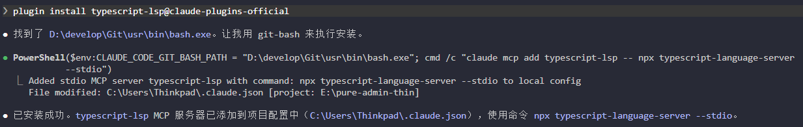

```bash
npx typescript-language-server --stdio
```

### Context7

> [https://github.com/upstash/context7](https://github.com/upstash/context7)

Context7 是给 Claude Code 等 AI 用的「实时文档外挂」

你是否遇到过这样的情况：

- AI助手生成的代码无法编译，使用了已废弃的API
- 花费大量时间在文档网站和AI工具之间切换
- AI基于过时知识生成代码，导致频繁调试

```bash
claude mcp add context7 -- npx -y @upstash/context7-mcp@latest
npx ctx7@latest setup
```

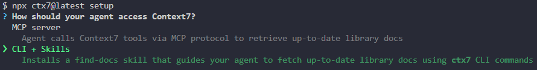

它会问是安装 MCP 服务还是 CLI + Skills，这里我选择 CLI + Skills。现在越来越多工具已经从 MCP 转向 CLI + Skills 的方式了。之后再弹出的网页中授权

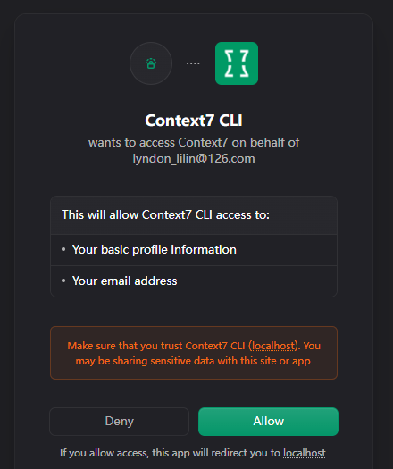

如果安装失败了，可以先尝试关闭本地拦截软件

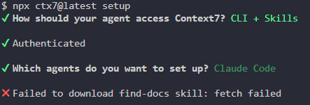

还想不行的话，可以手动安装 Skills

```bash
# 直接安装 find-docs 技能
claude skills install find-docs
```

## Agent

Agent = 能自主思考、自主规划、自主调用工具、自主纠正错误的 AI

不是你问一句它答一句，而是：它能自己拆解任务->查资料->调用工具->记住上下文->自我修正->完成目标

### Prompt（提示词）

定义 Agent 的角色、能力边界、行为规范。

```typescript
const SYSTEM_PROMPT = `你是一个运维助手，职责：
1. 查询天气信息
2. 天气异常时发送邮件提醒
规则：
- 一次只调用一个工具
- 工具失败时不要重复调用，改为报告给用户
- 不确定的事情不要猜测，直接说"我不确定"`
```

| 要素     | 示例                 | 缺了会怎样                    |
| -------- | -------------------- | ----------------------------- |
| 角色定义 | "你是运维助手"       | 模型不知道自己的定位          |
| 能力清单 | "可以查天气、发邮件" | 模型不会用工具                |
| 行为约束 | "一次只调一个工具"   | 模型可能一次发 5 个 tool call |
| 失败策略 | "失败时报告用户"     | 死循环重试                    |
| 边界声明 | "不确定不要猜"       | 幻觉                          |

### Context（上下文）

Context 是模型"当下能看到的所有信息"：System Prompt + 历史对话 + 工具结果。它受 token 上限约束。

```typescript
// 问题：长对话超出窗口
const MAX_TOKENS = 128_000
let contextTokens = estimateTokens(SYSTEM_PROMPT)

// 策略1：滑动窗口（保留最近 N 轮）
function slidingWindow(messages: Message[], keepRounds: number): Message[] {
  const rounds = groupByRound(messages)
  return rounds.slice(-keepRounds).flat()
}

// 策略2：摘要压缩（把旧对话压成一段话）
async function summarize(messages: Message[]): Promise<string> {
  return callLLM(`把以下对话总结为一段话，保留关键信息：
${messages.map(m => `${m.role}: ${m.content}`).join("\n")}`)
}
```

### Tools（工具）

这是 Agent 最核心的模块。模型不执行工具，它只是输出"我想调哪个函数、传什么参数"，由你的代码（Harness）来执行。

```typescript
// 工具的"肉身"——真正的执行逻辑
const toolExecutors: Record<string, (args: any) => any> = {
  get_weather(city: string) {
    // 生产环境调天气 API，这里模拟
    const conditions = ["sunny", "cloudy", "rain", "storm"]
    const weather = conditions[Math.floor(Math.random() * conditions.length)]
    return { city, weather, temperature: 15 + Math.floor(Math.random() * 20) }
  },

  send_email(to: string, subject: string, body: string) {
    // 生产环境调邮件服务
    console.log(`[EMAIL] To: ${to}, Subject: ${subject}`)
    return { sent: true, to, subject }
  }
}
```

Harness = 这个循环本身。它不思考、不记忆、不执行工具，只做一件事：在模型和工具之间当传话筒。

```typescript
interface AgentMessage {
  role: "user" | "assistant" | "tool"
  content: string
  tool_calls?: {
    id: string
    function: { name: string; arguments: string }
  }[]
  tool_call_id?: string
}

async function agentLoop(
  userMessage: string,
  history: AgentMessage[],
  maxIterations = 5
): Promise<string> {
  // 构建当前 Context
  const messages: AgentMessage[] = [
    { role: "user", content: userMessage }
  ]

  for (let i = 0; i < maxIterations; i++) {
    const response = await callLLM({
      model: "gpt-4o",
      messages: [
        { role: "system", content: SYSTEM_PROMPT },
        ...history,
        ...messages
      ],
      tools: tools.map(t => ({
        type: "function",
        function: t
      }))
    })

    const msg = response.choices[0].message
    messages.push(msg)

    // 模型返回最终答案 → 结束
    if (!msg.tool_calls || msg.tool_calls.length === 0) {
      return msg.content
    }

    // 模型要调工具 → 执行并把结果塞回 Context
    for (const tc of msg.tool_calls) {
      const fn = toolExecutors[tc.function.name]
      const args = JSON.parse(tc.function.arguments)

      try {
        const result = await fn(args)
        messages.push({
          role: "tool",
          tool_call_id: tc.id,
          content: JSON.stringify(result)
        })
      } catch (error) {
        messages.push({
          role: "tool",
          tool_call_id: tc.id,
          content: JSON.stringify({ error: String(error) })
        })
      }
    }
    // 循环继续：模型看到工具结果后决定下一步
  }

  return "已达到最大迭代次数，任务未完成。"
}
```

**工具设计原则**

- **description 要具体**：不是"查询信息"，而是"查询城市天气，用于天气相关判断"
- **一个工具只做一件事**：`get_weather` 和 `send_sms` 分开，不要合为 `do_everything`
- **返回结构化数据**：JSON 而不是自然语言，方便模型解析
- **错误要返回给模型**：不要吞掉异常，让模型知道"这个工具失败了"它才能换策略

### Memory（记忆）

Context 只在本轮有效。Memory 解决跨轮次记住信息的问题。

**三层记忆模型**

```bash
┌──────────┐  时效：当前任务  容量：Context 窗口  实现：消息数组
│ 工作记忆  │  → 本轮对话 + 工具结果
└──────────┘

┌──────────┐  时效：数小时到天  容量：几 KB     实现：JSON/Key-Value
│ 短期记忆  │  → 用户偏好、当前会话事实
└──────────┘

┌──────────┐  时效：数月到年    容量：无限制     实现：向量数据库
│ 长期记忆  │  → 用户画像、历史经验
└──────────┘
```

简单实现 key-value Store

```typescript
import fs from "fs"

class MemoryStore {
  private facts: Record<string, string> = {}
  private filePath: string

  constructor(userId: string) {
    this.filePath = `./data/${userId}-memory.json`
    if (fs.existsSync(this.filePath)) {
      this.facts = JSON.parse(fs.readFileSync(this.filePath, "utf-8"))
    }
  }

  get(key: string): string | undefined {
    return this.facts[key]
  }

  set(key: string, value: string) {
    this.facts[key] = value
    fs.writeFileSync(this.filePath, JSON.stringify(this.facts))
  }

  // 每轮对话后，让模型从对话中提取关键事实
  async learn(userMsg: string, assistantMsg: string) {
    const prompt = `从以下对话中提取关键用户信息，返回 JSON 格式（只输出 JSON，不要其他内容）：
用户消息：${userMsg}
助手回复：${assistantMsg}

示例输出：{"preferred_city":"上海","user_email":"zhangsan@qq.com"}
如果没有可提取的信息，返回 {}`

    const result = await callLLM({
      messages: [{ role: "user", content: prompt }]
    })
    const facts = JSON.parse(result)
    Object.entries(facts).forEach(([k, v]) => this.set(k, v as string))
  }

  // 把记忆注入到 System Prompt
  toPrompt(): string {
    const entries = Object.entries(this.facts)
    if (entries.length === 0) return ""
    return `## 已知用户信息\n${entries.map(([k, v]) => `- ${k}: ${v}`).join("\n")}`
  }
}
```

当事实量大到 Key-Value 装不下时，用 embedding + 向量搜索：

```typescript
// 伪代码：语义检索
async function searchMemory(query: string, k = 5): Promise<string[]> {
  const queryEmbedding = await embed(query)
  const results = await vectorDB.search(queryEmbedding, k)
  return results.map(r => r.text)
}
```

### Feedback（反馈）

让 Agent 在执行后评估自己的输出，发现错误就重试。

```typescript
interface FeedbackResult {
  ok: boolean
  suggestion?: string    // 失败时的修正建议
  retryArgs?: object     // 重试时的修正参数
}

async function executeWithFeedback(
  toolName: string,
  args: object,
  maxRetries = 2
): Promise<any> {
  for (let attempt = 0; attempt <= maxRetries; attempt++) {
    const result = await toolExecutors[toolName](args)

    // 让模型评估结果
    const review = await callLLM({
      messages: [{
        role: "user",
        content: `评估以下工具执行结果。返回 JSON（只输出 JSON）：
工具：${toolName}
参数：${JSON.stringify(args)}
结果：${JSON.stringify(result)}

格式：
{
  "ok": true/false,
  "suggestion": "失败时的一句话建议",
  "retryArgs": { /* 修正后的参数，成功时返回 null */ }
}`
      }]
    })

    const feedback: FeedbackResult = JSON.parse(review)

    if (feedback.ok) {
      return result
    }

    if (attempt < maxRetries && feedback.retryArgs) {
      console.log(`[Feedback] 第${attempt + 1}次失败: ${feedback.suggestion}`)
      console.log(`[Feedback] 重试参数: ${JSON.stringify(feedback.retryArgs)}`)
      args = feedback.retryArgs  // 用修正后的参数重试
      continue
    }

    throw new Error(`工具 ${toolName} 执行失败: ${feedback.suggestion}`)
  }
}
```

| 场景     | 适合 Feedback？ | 原因                           |
| -------- | :-------------: | ------------------------------ |
| 天气查询 |       否        | API 返回要么对要么错           |
| 代码生成 |       是        | 运行报错 → 看错误信息 → 修代码 |
| 数据提取 |       是        | 格式不对 → 调整正则 → 重试     |
| 搜索     |       是        | 没结果 → 换关键词 → 再搜       |

**核心判断标准**：失败时有没有明确的信号（报错信息、空结果）可以用来修正下一次尝试。

### Guardails（护栏）

有两道防线：输入护栏（拦用户）、输出护栏（拦模型）。

**输入护栏**

```typescript
const inputGuardrails = {
  // 危险模式检测
  blockedPatterns: [
    /rm\s+-rf/i,
    /DROP\s+TABLE/i,
    /delete\s+(all|everything)/i,
    /eval\s*\(/i,
    /__proto__/i
  ],

  // 敏感信息检测
  sensitivePatterns: [
    /password\s*[:=]\s*\S+/i,
    /secret\s*[:=]\s*\S+/i,
    /token\s*[:=]\s*\S+/i
  ],

  check(input: string): { pass: boolean; reason?: string } {
    // 先脱敏
    for (const pattern of this.sensitivePatterns) {
      if (pattern.test(input)) {
        return { pass: false, reason: "输入包含疑似敏感信息，已拦截" }
      }
    }
    // 再查危险操作
    for (const pattern of this.blockedPatterns) {
      if (pattern.test(input)) {
        return { pass: false, reason: "输入包含危险操作指令，已拦截" }
      }
    }
    return { pass: true }
  }
}
```

**输出护栏**

```typescript
interface ToolCall {
  function: { name: string; arguments: string }
}

const outputGuardrails = {
  // 需要用户确认的操作
  requireConfirmation: ["send_email", "delete", "execute_sql", "transfer"],

  // 参数长度限制
  maxArgLength: 10000,

  check(toolCall: ToolCall): { pass: boolean; reason?: string } {
    const { name, arguments: args } = toolCall.function

    // 参数不能太长（防止注入超大 payload）
    if (args.length > this.maxArgLength) {
      return { pass: false, reason: `参数过长 (${args.length} 字符)，已拦截` }
    }

    // 危险操作标为需要确认
    if (this.requireConfirmation.some(op => name.includes(op))) {
      return { pass: true, reason: "需要用户确认" } // pass 但触发确认流程
    }

    return { pass: true }
  }
}
```

**护栏原则**

- **默认拒绝**：拿不准的操作先拦，比漏过去好
- **用户确认**：写操作（发邮件、删数据、转账）必须人点确认
- **可审计**：所有被拦截的操作都要记日志
- **不替代业务校验**：护栏是最后防线，不是唯一防线
