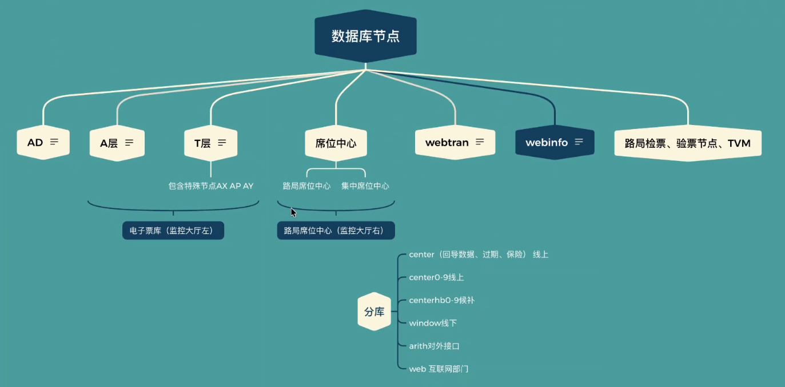

## 复制队列

> 占用空间大于阈值、连续多次无法连接、实例或服务down

通常意味着复制链路出现了问题，可能导致数据延迟激增，甚至有数据丢失的风险

**复制队列占用空间大于阈值**

数据产生速度远远超过了复制发送的速度，导致数据在队列中积压，核心问题：**消费速度 < 生成速度**

1. **网络问题**（最常见）

   宽带不足、网络延迟高、网络不稳定/丢包

2. **目标端性能瓶颈**

   从节点资源不足、从节点负载过重

3. **源端或复制任务本身的问题**

   大批量操作、复制冲突/错误、配置不当

**多次无法连接**

复制消费者（从节点）与生产者（主节点）之间的网络链路或认证层面出现了故障，复制进程完全中断。核心原因：**复制链路的基础连接已断开**

1. **网络层面中断**

   防火墙/安全组规则变更、网络设备故障、IP地址或端口变更、VPN或专线故障

2. **节点本身问题**

   主节点或节点宕机/重启、从节点进程停止

   一般都会有负载均衡器来进行健康检查，定期探测后端实例的健康状态。通过编排平台或定时任务根据预设规则自动重启

3. **权限与认证问题**

   密码变更、权限被撤销

排查流程：

1. 优先级判断：先解决无法连接问题再处理队列积压
2. 检查网络连通性：`telnet <主节点IP> <端口>` 测试是否能连接到主节点，使用 ping 检查基础网络是否通畅
3. 检查节点状态：确认主节点和从节点是否都在运行，检查复制状态（MySQL: SHOW SLAVE STATUS\G），查看系统日志
4. 检查资源使用问题：使用 top、iostat、vmstat 检查从节点的CPU、内存和磁盘I/O使用率
5. 检查配置与权限

## 系统监控指标

| **指标**   | **全称**                | **核心关注点**                                           | **常用单位**         | **形象比喻**                             |
| :--------- | :---------------------- | :------------------------------------------------------- | :------------------- | :--------------------------------------- |
| **QPS**    | Queries Per Second      | 系统每秒能处理的**请求数量**（吞吐能力）                 | 次/秒                | 每分钟通过收费站的车流量                 |
| **TPS**    | Transactions Per Second | 系统每秒能完成的**完整事务数量**（业务处理能力）         | 次/秒                | 每分钟完整完成的交易笔数                 |
| **RT**     | Response Time           | 单个请求从发送到接收响应所需的**时间**（用户体验）       | 毫秒(ms)             | 车辆通过收费站所需的时间                 |
| **并发量** | Concurrency             | 系统**同时**处理的请求数量（系统并行负载能力）           | 个                   | 同时正在通过收费站的车辆数               |
| **吞吐量** | Throughput              | 单位时间内系统成功处理的**数据量或请求总量**（综合效率） | 字节/秒 或 请求数/秒 | 收费站单位时间内处理的总货物吨位或车辆数 |

这些指标不是孤立的，它们相互影响，共同决定了系统的整体性能表现。

QPS = 并发数 / 平均RT

- 在并发数一定的情况下，**降低RT可以有效提升QPS**。反之，在RT不变的情况下，想要提升QPS，就必须增加系统的并发处理能力

优化策略：

- **提升QPS/TPS**：常用的方法包括引入缓存（如Redis）、异步化处理（用消息队列解耦）、负载均衡（横向扩展服务器）等
- **降低RT**：优化数据库（加索引、避免慢查询）、使用CDN加速静态资源、代码性能优化等是常见手段
- **管理并发数**：合理设置线程池、连接池，实施限流和熔断机制（如Sentinel、Hystrix），防止系统因并发过高而被压垮

## 消费出现错误

**接收端消费出现问题**

历史集群接收端出现消费错误，绝不仅仅是一个简单的程序错误，它会像多米诺骨牌一样引发一系列连锁反应

直接和立即的影响

1. 数据消费停滞/延迟
   - 最直接表现就是消费组和消费偏移量停止前进。新的数据不断涌入队列，但无人处理，导致数据积压
2. 消息堆积
   - 由于消费停止，而生产端通常仍在持续工作，消息队列（如 Kafka、RocketMQ）中的消息数量会急剧增长
   - 这会导致消息的端到端延迟越来越高。原本需要实时处理的数据，可能变成几分钟、几小时甚至几天前的历史数据

对系统性能和稳定性的影响

1. 资源消耗与压力传导
   - 存储压力：消息积压首先会占用大量的磁盘空间。如果积压严重，可能触发集群的磁盘告警甚至写满磁盘，导致整个集群不可用
2. 偏移量管理问题
   - 如果错误处理不当，消费者可能会持续提交错误的偏移量
   - 这个能导致消息丢失或消息重复

**消费堆积**

- 增加消费者实例或线程
  - 增加消费者实例数量
  - 在单个消费者实例中，可以通过调整线程池配置或使用多线程来并行处理消息，提高吞吐量
- 优化消费逻辑
  - 简化处理流程：检查消费逻辑，将不必要的同步操作改为异步，避免在消息处理中进行繁重的计算或耗时操作
  - 批量操作：对数据库写入、远程调用等操作，尽量合并成批量请求，减少I/O次数
  - 使用缓存：对频繁读取的数据引入缓存，减少对数据库等底层资源的直接访问
- 调整消费参数
  - 适当增加 `max.poll.records`（每次拉取的消息数）和 `fetch.max.bytes`（每次拉取的数据量大小）等参数，可以提高拉取效率，但需注意内存消耗
  - 调整 `session.timeout.ms`和 `heartbeat.interval.ms`，防止因网络抖动导致消费者被误判死亡而引发不必要的重平衡

## Redis集群

Codis 集群和 Redis Cluster 都是为解决单机 Redis 的性能、容量瓶颈而生的分布式缓存/存储解决方案

Codis通过引入一个代理层（Proxy）来屏蔽后端的分布式细节，其核心组件分工明确：

- Codis Proxy（代理）：客户端直接连接的对象。它接收所有请求，根据预定义的分片规则，计算出数据所在的Slot，然后将请求转发给正确的Redis实例。客户端像使用单机Redis一样与Proxy交互，无需感知后端集群
- Codis Dashboard（控制台）：集群的管理大脑。负责维护Slot与Redis实例的映射关系，处理扩容、缩容、数据迁移等操作，并通过ZooKeeper或Etcd同步元数据，确保所有Proxy有一致的视图
- Codis Server（数据节点）：实际存储数据的Redis实例。它们被分组，每个组通常是一个主从复制单元，负责存储分配给自己的那些Slot里的数据
- 协调组件（ZK/Etcd）：充当分布式配置中心。持久化存储Slot的映射关系，确保集群状态的一致性

Redis Cluster采用去中心化的设计，每个节点都承担部分工作和协调任务：

- 节点角色：集群中的每个Redis实例都是对等的，既存储数据，也参与集群状态的维护。每个主节点负责一部分Slot，并从节点提供数据冗余和故障转移
- Gossip协议：节点间通过P2P的Gossip协议通信，不断交换信息， 最终扩散到整个集群，使每个节点都知晓其他节点以及Slot的分布情况
- 客户端路由：客户端需要支持Cluster协议。它首先会获取一份Slot分布图，之后可以直接将请求发送到正确的节点。如果请求了错误的节点，会收到-MOVED重定向响应，客户端需要更新本地缓存并重试

Redis哨兵（Sentinel）是用于管理Redis主从架构高可用性的官方方案

- Redis哨兵是一个独立的进程，它会持续监控主节点（Master）和从节点（Slave）是否正常运行
- 故障转移（Failover）：这个是其核心功能。当主节点被判定为故障时，哨兵机制会自动启动故障转移流程：从剩余的从节点中选举出新的主节点，并让其他从节点开始复制新主节点，同时通知客户端连接新的主节点
- 主要作用：极大提升Redis服务的可用性，避免单点故障导致服务长时间中断，实现故障自动恢复

## 12306全链路

全链路流程可分为：互联网入口层、CDN层、客服外网层、客服内网层、客票网层，每层承担不同技术职责，实现：流量接入-安全防护-业务逻辑-核心交易的分层解耦

1. 互联网入口层：多ISP+云厂商的弹性接入
   - 网络入口：通过华为云、阿里云和联通/铁通/电信实现多ISP接入，覆盖不同区域用户，减少跨网延迟
2. CDN层：静态资源加速的第一道缓冲
   - 核心作用：缓存页面、图片、脚本等静态资源，减少源站压力，提升全球访问速度
3. 客服外网层：流量分发与终端适配
   - 二中心流量大概是一中心流量的2倍
   - 统一接入层：流量的总闸门，负责负载均衡、协议解析
   - 风控引擎：反爬虫、防刷票的安全卫士，基于用户行为、设备指纹等维度拦截恶意请求
4. 客服内网层：业务逻辑的中枢神经
   - 统一认证：用户身份验证的门禁，支持登录、权限管理
   - 排队系统：防止超卖的公平秤，通过队列管理订单顺序
   - 候补服务：无票时的承诺机制，记录候补请求并在有票时自动履约
   - 查询服务（余票/乘客）：高频查询的响应器，实时返回余票、乘客信息
5. 客票网层：核心交易的心脏地带
   - 交易中间件：订单创建的事务协调者，保障分布式场景下的数据一致性
   - 7.0服务化（微服务集群）：业务逻辑的积木化拆分，通过微服务解耦复杂业务
   - 常旅客积分/二维码/人脸核验：会员权益、无接触服务的增值模块，提升用户体验
   - PSR集群/电子票库/实名制集群：资源与数据的存储中枢
   - 路局负载中心/席位库中库/CTMS：系统协同的神经中枢

12306全链路流程：是互联网高并发技术（分布式、缓存、消息队列）与传统行业业务规则（票务逻辑、实名制、运力协同）深度融合的典范。**技术始终服务于业务，而业务复杂性倒逼技术架构持续进化**

## 12306关键组件

一旦出现停电导致单数据中心出现瘫痪时，可根据CDN进行流量切换至另一中心，非高峰期核心业务可以保持基本运行，但通知平台（仅在二中心）、人脸核验平台（仅在二中心）、二维码平台（密码机仅在二中心）、商旅数据库、国铁检票数据库（仅在一中心），电话订票数据库（仅在二中心）由于依然为单中心建设，将影响客票系统相关功能使用

1. CDN：主要域名均配置一二中心回源策略，异常情况能够自动将请求转到另一中心

2. 统一接入平台：包括手机集群、小程序集群、网站集群、统一认证集群、线下集群，均为单独部署，单个集群节点出现故障只会影响对应业务的办理

   

3. 风控决策引擎：决策引擎上游各客户端均有调用决策引擎的开关，当决策引擎出现异常不可用时，上游客户端可关闭引擎调用；决策引擎自身有降级开关，可主动降低甚至关闭业务决策卡控功能

   

4. Mpass：业务主要有业务网关、资源下发、日志分析、安全防护

   

5. otsMobile：业务主要有购退改查主流程、购退查候补订

   

6. 网站OTN：OTN模块支持在AS、支付回调、缓存、统一认证、排队功能异常时切换另一中心或者降级使用

   

7. 小程序服务：小程序服务主要为支付宝、微信、国铁吉讯小程序提供后台服务

   

8. 车站大屏

   

9. 通知系统：通知服务只部署在二中心

   

10. 余票查询服务：余票查询服务为手机、网站、小程序等业务提供余票查询接口

    

11. 统一认证平台

    

12. 候补系统

    

13. 排队系统

    

14. AS 服务：5个主要AS分组（用户、查询、订单查询、交易、支付）

    

15. 余票集群

16. 用户集群

17. 乘车人集群

18. 实名制集群

19. PSR集群

20. 新产品集群

21. 客服武清集群

22. 线下余票集群

23. 人脸识别平台

24. 站车交互系统

25. ctmsx数据同步服务：ctmsx服务器主要用于异构环境的数据同步，将sybase复制服务器对复制主点的数据操作动作同步到复制从点，同时转发到rabbit MQ中，由中间程序消费mq的队列，将数据操作动作同步到数据库、PSR中，最终实现数据同步

26. 集中限流控制平台

27. 交易编排

28. 新产品：当前新产品业务包含新型客票产品，E卡通预约取号，旅游套票等业务服务

29. 二维码平台

30. 交易中间件：交易中间件INETIS主要为互联网渠道12306APP与12306WEB提供售票交易接口服务

31. 积分INETIS

32. 团体票INETIS

33. ADCTMS

34. AUCTMS：AUCTMS主要为线下车站与站车业务提供余票查询、PSR查询、联系方式查询、导航查询、电子发票、车上验票等功能

35. 路局CTMS：路局中心的线上/线下的售、退、改与实名制核验业务

36. 线上退票

37. 常旅客

39. 支付平台

40. WEBTRAN数据库：为互联网售票系统和用户相关的数据

41. 电子票库

42. AT1数据库部署在一中心和武清中心：AD数据库部署于二中心和武清中心、AT1数据库部署在一中心和武清中心

43. AX、AP、AY：AX数据库部署于一中心、AP数据库部署于一中心、AY数据库部署于二中心

44. 网络设备

45. 负载均衡器

46. 商旅-AX：包含售、退、改、支付等5个业务服务

47. 自动检(验)票系统：检票系统分为站控和局控，全路目前89个节点

48. 自动售票系统：自动售票系统全路目前33个节点左右

## 数据库节点

- **A D库**：作为基础数据原节点，通过中间件（如MQ、CTMS）向其他数据库复制通用规则与字典数据。
- **A层与T层**：A层负责线上售票业务，T层负责退票、改签、线下售电子票及电子发票；T层在A层命名基础上加“T”标识，互为主备；特殊节点如AP、HR、AY因涉及改签/退票归入T层。
- **席位中心**：分路局席位中心（如P1、P2）与集中席位中心，负责余票数据，通过中间件同步至集群，监控大厅右侧展示。
- **Web Train**：存储用户乘车人信息、资质信息；检票节点与验票节点按路局部署，北京局等大站有多个节点；WebInfo与WebTrain为互联网部门使用，存放人脸等基础数据。
- **分库机制**：Center库（0-9）按哈希分表承载线上购票等高频数据；后补库与Center结构类似；Windows库用于窗口售票等线下业务；Risk库为对外接口库；外部库存放技术数据与早期外部接口表；Base库为从AD复制的基础数据副本。

## AS

User用户分组、Query查询分组、Trsquery订单、Tran交易、Pay支付、Integration积分、Extend延伸、Invoice发票
